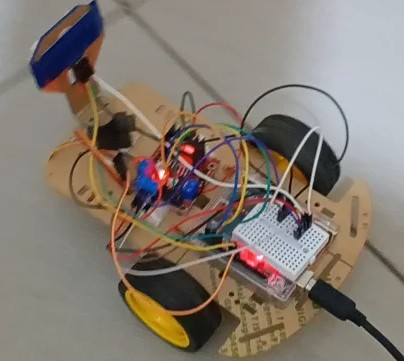

# Automatic Obstacle Avoidance Car

The primary aim of this project is to develop a mobile robotic platform capable of autonomous navigation in an unpredictable environment. The robot must identify obstacles and independently determine the optimal path for avoidance. 
The project achieves intelligent, self-governing movement without human intervention.

---

## 🗂️ Project Structure
Automatic_Obstacle_Avoidance_Car/
 
├── src/ # Folder containing project files, Arduino & ESP32 codes
 
├── requirements.txt # Libraries and Dependencies
 
├── Report_Automatic_Obstacle_Avoidance_Car.pdf # Summary of the project methodology and results
 
└── README.md # Project description (this file)

---

## 📊 Overview

The Autonomous Obstacle Avoidance Car is an IoT-based solution designed for:
- Real-time Sensing
- Automated Movement & Decision-Making
- Alerts & Feedback

---

## 🧩 Hardware Components

- Arduino UNO
- Ultrasonic Sensor (HC-SR04)
- Standard Servo Motor
- DC Geared Motors
- L298N Motor Driver Module
- Mini car Chassis
- Wheels and Caster Wheel
- Power supply

---

## 🛠️ Tools & Technologies

- Languages: Embedded C/C++
- Frameworks: Arduino IDE

---

## 🚀 SWMT Project Implementation Guide
### 1. Clone this project

`git clone https://github.com/Cyber-Trinity/Internet-of-Things.git`

`cd Internet-of-Things/Automatic_Obstacle_Avoidance_Car`

### 2. Install dependencies

`pip install -r requirements.txt`

### 3. Follow the instructions contained in the report

---

## 📑 Report

A detailed project report is included as [Report_Automatic_Obstacle_Avoidance_Car.pdf](https://github.com/Cyber-Trinity/Internet-of-Things/blob/main/SWMT/Report_Automatic_Obstacle_Avoidance_Car.pdf)
 explaining the project design, methodology, implementation, and results
