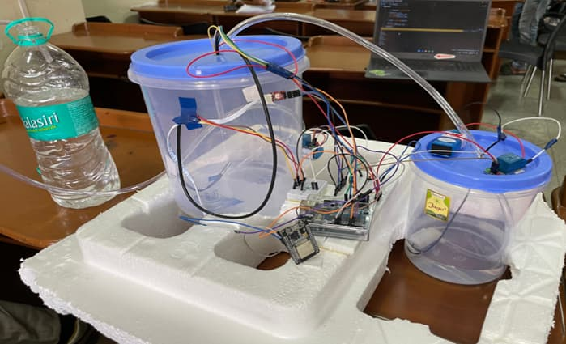

# Smart Water Management Technology (SWMT)

Water is one of the most vital resources on Earth, yet its efficient management remains a global challenge due to urbanization, industrial growth, and climate change.
The Smart Water Management Technology (SWMT) project leverages IoT, Cloud Computing, and Artificial Intelligence to create a smart, automated system for monitoring and optimizing water usage.

This project demonstrates how IoT-based sensors, real-time data processing, and predictive analytics can work together to improve water efficiency, detect leaks, and support sustainable resource management.

---

## 🗂️ Project Structure
SWMT/
 
├── src/ # Folder containing project files, Arduino & ESP32 codes
 
├── requirements.txt # Libraries and Dependencies
 
├── Presentation_SWMT.pptx # PowerPoint presentation of the project
 
├── Report_SWMT.pdf # Summary of the project methodology and results
 
└── README.md # Project description (this file)

---

## 📊 Overview

The Smart Water Management Technology (SWMT) system is an IoT-based solution designed to:
- Monitor water levels, quality, and temperature in real time
- Remote access and control of the system
- Automate tank refilling and valve control
- Optimize water consumption through predictive analytics
- Provide alerts and recommendations via a cloud-based dashboard
- Encourage user awareness and behavioral change for sustainability

---

## 🧩 Hardware Components

- Arduino UNO
- ESP32 Wi-Fi Module
- Ultrasonic Sensor (HC-SR04)
- Turbidity Sensor
- DS18B20 Temperature Sensor
- DC Water Pumps (Pump 1 & Pump 2)
- Relay Module
- Container (Acting as water tank)
- Power supply
- Wifi Connectivity

---

## 🛠️ Tools & Technologies

- Languages: Embedded C/C++, JavaScript
- Frameworks: Arduino IDE
- Protocol: MQTT, HTTPs
- Cloud Platform: Thingspeak

---

## 🚀 Project Implementation Guide
### 1. Clone this project

`git clone https://github.com/Cyber-Trinity/Internet-of-Things.git`

`cd Internet-of-Things/SWMT`

### 2. Install dependencies

`pip install -r requirements.txt`

### 3. Follow the instructions contained in the report

---

## 📑 Report

A detailed project report is included as [Report_SMWT.pdf](https://github.com/Cyber-Trinity/Internet-of-Things/blob/main/SWMT/Report_SWMT.pdf)
 explaining the project design, methodology, implementation, and results

---

## 📰 Publication

This project, Smart Water Management Technology (SWMT), has been officially published in the International Journal of Innovative Research in Technology (IJIRT).
 

**Paper Title:** Smart Water Management Technology: An IoT-Based Solution for Efficient Water Resource Management

**Journal:** International Journal of Innovative Research in Technology (IJIRT)

**Manuscript ID:** IJIRT-174039 | Volume 11 Issue 10

**ISSN:** 2349-6002

**DOI:** 10.5281/zenodo.15074417

**Publication Date:** March 2025
 

**Access the Publication:**

🔬 [ResearchGate Publication](https://www.researchgate.net/publication/390120107_Smart_Water_Management_Technology_An_IoT-Based_Solution_for_Efficient_Water_Resource_Management)

📘 [IJIRT Official Page](https://ijirt.org/Article?manuscript=174039)

🧠 [Zenodo Repository](https://zenodo.org/records/15074418)

---

## ✨ Credits

Project Contributors:
- Shahd K
- Herve C. Ineza
- Ravi Giri
- Amara A. Kamara
- Djatassiba Yaovi Joël (Me)
 

Under the Guidance of:
Dr. Suresh Kallam
Head, Department of Computer Science & Engineering
Jain (Deemed-to-be University), Bengaluru, India

